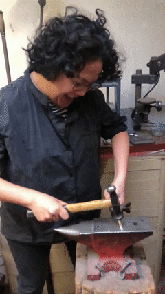

We're getting married!

## Schedule

| <!-- -->  | <!-- -->  |
| ------------- |:-------------:|
|    |  **Wednesday, 2020 April 1** 	|
| 7:00PM | Dinner at our home! |
| | |
|    |  **Thursday, 2020 April 2** 	|
| 1:00PM | Buro and Maggie @ City Hall, Marriage Portraits |
| 2:30PM | Family Arrive @ City Hall |
| 3:00PM | Family Portraits |
| 3:30PM | Civil Commitment Ceremony |
| 4:00PM | Exit from City Hall |
| 6:00PM | Dinner (Location TBD!) |
| | |
|    | **Friday, 2020 April 2** 	|
| TBD | TBD |

(All times are PST.)

## The Ceremony

The civil ceremony will be held at or near [the Grand Staircase][city_hall] in
SF City Hall; the judge performing the civil ceremony chooses the ultimate
location. You will need to enter on Polk Street; please allow enough time to
pass through security.

<iframe src="https://www.google.com/maps/embed?pb=!1m14!1m8!1m3!1d788.3660302139727!2d-122.41960648038364!3d37.77916158228222!3m2!1i1024!2i768!4f13.1!3m3!1m2!1s0x0%3A0xb2706dff83574f4a!2sSan%20Francisco%20City%20Hall!5e0!3m2!1sen!2sus!4v1583093188369!5m2!1sen!2sus" width="600" height="450" frameborder="0" style="border:0;" allowfullscreen="" align="middle"></iframe>
  
[city_hall]: https://www.nytimes.com/2011/08/21/us/21bcintel.html

## What to do (and what to avoid) in SF?

If you do nothing else while in town, we recommend spending time in *Golden Gate
Park* and the [*Garden for the Environment*][gfe]. We've also made [**this
map**][sf_map] for key locations and recommendation during the week and will
rent a car to ferry folks around.

We **strongly recommend** that you avoid Downtown, Fisherman's Wharf, and the
Market Street corridor during the business week.

[gfe]: https://www.gardenfortheenvironment.org/
[sf_map]: https://www.google.com/maps/d/u/1/edit?hl=en&mid=1i1y9zUZi0Qa98VZmPFJftnVRfzKyWrYX&ll=37.77388907581863%2C-122.46138887960802&z=16

## Photos

We'll share photos of the City Hall event in this [album][album], and will send
out print copies when they are available. Please upload any photos to the
[album][album].

[album]: https://photos.app.goo.gl/TmqBUNtuzrUn7Dxd8

## Registry

We do not have a registry and actually have no room for gifts! Your presence is
the greatest gift to us. Should you still feel the need to make a contribution,
we recommend making a donation to any of the following organizations:

- [The Interational Rescue Committee](https://www.rescue.org/)
- [Larkin Street Youth Services](https://larkinstreetyouth.org/)

## FAQ

### [Coronavirus][covid-19]?

We are closely monitoring the news about Coronavirus in the Bay Area: **please
let us know if you have any concerns**. We expect airlines to restrict domestic
air travel into San Francisco if the situation deteriorates. If we feel that
travel to SF poses a danger, we will reschedule the civil ceremony for later in
2020.

Check the [SFDPH status page][sfdph] for local updates.

[sfdph]: https://www.sfdph.org/dph/alerts/coronavirus.asp

### What should I wear?

Layers! San Francisco is chilly most of the year; we recommend bringing a jacket
and a light sweater as appropriate.

For any questions not covered, please contact [Buro](mailto:mookerji@gmail.com)
and [Maggie](mailto:emmbeezee@gmail.com), or text us directly.

[covid-19]: https://www.cdc.gov/coronavirus/2019-ncov/summary.html

### SEE YOU SOON!

|   <!-- -->            |     <!-- --> |
:-------------------------:|:-------------------------:
  |  
