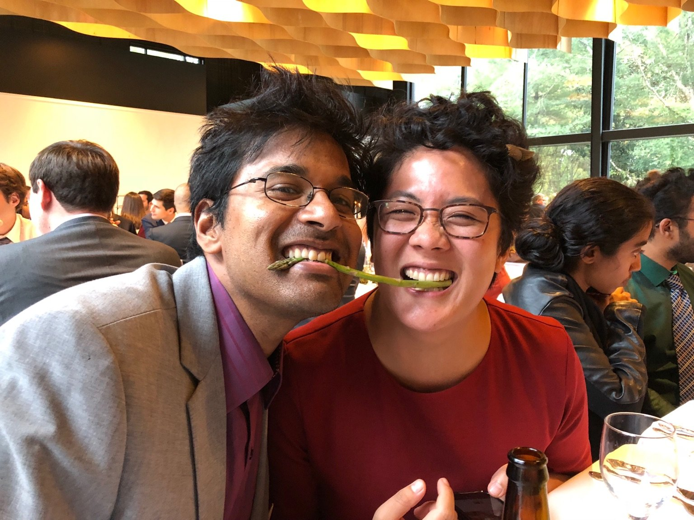

{:refdef: style="text-align: center;"}
{:class="img-responsive" style="max-width: 75%; height: auto;"}
{: refdef}

 

    <strong>
        <i>
            🎉&nbsp;&nbsp;We're getting married!&nbsp;&nbsp;🥳
        </i>
    </strong>

 
 

## 📅 Schedule

<table style="border-style: hidden; background-color: white" width="70%">
  <tbody>
    <tr style="background-color: white">
      <td style="border-style: hidden; text-align: center;"> </td>
      <td style="text-align: center; border-style: hidden;"> </td>
    </tr>
     <tr style="background-color: white">
      <td style="border-style: hidden; text-align: center;"> </td>
      <td style="text-align: center; border-style: hidden;"><strong>Thursday, 2022 May 5</strong></td>
    </tr>
    <tr style="background-color: white">
      <td style="border-style: hidden; text-align: center;">6:00PM?</td>
      <td style="text-align: center; border-style: hidden;">Family Welcome Dinner — TBD location</td>
    </tr>
    <tr style="background-color: white">
      <td style="border-style: hidden; text-align: center;"> </td>
      <td style="text-align: center; border-style: hidden;"><strong>Friday, 2022 May 6</strong></td>
    </tr>
    <tr style="background-color: white">
      <td style="border-style: hidden; text-align: center;">10:00AM</td>
      <td style="text-align: center; border-style: hidden;">Buro and Maggie Get Ready</td>
    </tr>
    <tr style="background-color: white">
      <td style="border-style: hidden; text-align: center;">3:00PM</td>
      <td style="text-align: center; border-style: hidden;">Wedding Ceremony @ Mather Redwood Grove</td>
    </tr>
    <tr style="background-color: white">
      <td style="border-style: hidden; text-align: center;">4:00PM</td>
      <td style="text-align: center; border-style: hidden;">Walk to UC Botanical Garden</td>
    </tr>
    <tr style="background-color: white">
      <td style="border-style: hidden; text-align: center;">6:00PM</td>
      <td style="text-align: center; border-style: hidden;">Dinner — Location and time TBD!</td>
    </tr>
    <tr style="background-color: white">
      <td style="border-style: hidden; text-align: center;"> </td>
      <td style="text-align: center; border-style: hidden;"> </td>
    </tr>
    <tr style="background-color: white">
      <td style="border-style: hidden; text-align: center;"> </td>
      <td style="text-align: center; border-style: hidden;"><strong>Saturday, 2022 May 7</strong></td>
    </tr>
    <tr style="background-color: white">
      <td style="border-style: hidden; text-align: center;">TBD</td>
      <td style="text-align: center; border-style: hidden;">Friends and Family Outdoor Picnic — Location and Details TBD</td>
    </tr>
     <tr style="background-color: white">
      <td style="border-style: hidden; text-align: center;"> </td>
      <td style="text-align: center; border-style: hidden;"><strong>Sunday, 2022 May 8</strong></td>
    </tr>
    <tr style="background-color: white">
      <td style="border-style: hidden; text-align: center;">11:00AM</td>
      <td style="text-align: center; border-style: hidden;">Family Goodbye Brunch — Location TBD!</td>
    </tr>
  </tbody>
</table>

(All times are PST.)

 

## 👰🏻🤵🏾 The Ceremony and Venue

The wedding ceremony will be held at the [Stephen T. Mather Redwood
Grove][ucb_grove] at the UC Botanical Garden at **200 Centennial Drive, Berkeley,
CA 94705**. We'll have parking available for everyone attending.

The venue itself has some **special rules**: don't disturb the plants or leave
designated trails. Beverages are prohibited. In the words of the Botanical
Garden:

> [The Mather Redwood Grove and UC Botanical Garden] are a museum collection of
> living plants that are not to be disturbed in any way; they have been
> collected in the wild at great expense and many are irreplaceable.

**Directions**: Driving up-hill on Centennial Drive, the grove and its parking
lot are **on the left-hand side of Centennial Drive** just past main UC
Botanical Garden entrance. When driving up, look out for bicyclists, hikers, and
students on or near the road. See the map below.

  

<iframe src="https://www.google.com/maps/embed?pb=!1m18!1m12!1m3!1d3149.3428438852993!2d-122.24142214901772!3d37.87566417964179!2m3!1f0!2f0!3f0!3m2!1i1024!2i768!4f13.1!3m3!1m2!1s0x80857c46306b0e89%3A0x8ec0c5ddd1e43bd!2sBotanical%20Garden%20Lot!5e0!3m2!1sen!2sus!4v1644810000818!5m2!1sen!2sus" width="600" height="450" style="border:0;" allowfullscreen="" loading="lazy"></iframe>

  

## 🌉 What to do in the Bay Area?

If you're in town for longer and have some time for tourism, let us know and we can offer some personal recommendations.

If you do nothing else while in town, we suggest that you visit:

- SF: Golden Gate Park and the [Garden for the Environment][gfe]. We volunteered at the Garden for the Environment for several years while living in SF, so you can check out some of our handiwork!
- Berkeley: Berkeley Bowl (east or west), UC Berkeley Main Campus, neighborhood stairwalks ([link 1][berkeley_paths], [link
  2][berkeley_paths1]), the view from the Lawrence Hall of Science.

We've also made [**this map**][sfbay_map] that includes both key locations during the week and some of our favorite places (incl. restaurants) in both SF and Berkeley. 

[gfe]: https://www.gardenfortheenvironment.org/
[sfbay_map]: https://www.google.com/maps/d/viewer?hl=en&mid=1i1y9zUZi0Qa98VZmPFJftnVRfzKyWrYX&ll=37.7808331084555%2C-122.25537206463261&z=11
[ucb_grove]: https://botanicalgarden.berkeley.edu/rentals-redwood-grove
[berkeley_paths]: https://www.berkeleypaths.org/path-list
[berkeley_paths1]: https://socalstairclimbers.com/tag/berkeley-stair-walking/

 

## 📸 Photos

We'll share photos of the Mather Grove event in this [album][album], and will send
out print copies when they are available. Upload any photos you take to the
[album][album]!

[album]: https://photos.app.goo.gl/xdXo85k2QW2CSyR17

 

## 📋 Registry

Your presence is the greatest gift to us (really truly!). We're so excited to celebrate with all of you and your support means the world.

However, for those of you who have expressed an interest, we've created a small gift registry [here](https://www.zola.com/registry/mookerzhou).
 
 

## 🤔 FAQ

### 🦠 [Coronavirus][covid-19]?

_We will continue to update this section as we get closer to the ceremony date._

We are closely monitoring news and policy about Coronavirus in the Bay Area and
are taking all possible precautions for ceremony:

- Attendance limited to 20 people
- Everyone attending the ceremony is fully vaccinated and boosted.
- The venue is outdoors.

If you are traveling by air to the Bay Area, we recommend booking travel and
accomodations soon. A few local rules here to prepare for:

- Many indoor venues -- including grocery stores -- require masks to
  enter. We'll have plenty to share.
- Some businesses -- such as restaurants -- require proof of vaccination to eat
  indoors.

[berkeley]: https://www.cityofberkeley.info/covid19/whats-open/
[berkeley-covid]: https://www.berkeleyside.org/2020/03/14/covid-19-berkeley-by-the-numbers-plus-some-key-resources-to-help-you-stay-informed

 

### 🧥 What should I wear?

Layers! San Francisco and Berkeley can get chilly! We recommend bringing a
jacket and a light sweater as appropriate.

For the ceremony on Friday, dress code is dressy casual. For Saturday's picnic, dress code is casual.

For any questions not covered, please contact [Buro](mailto:mookerji@gmail.com)
and [Maggie](mailto:emmbeezee@gmail.com), or text us directly.

[covid-19]: https://www.cdc.gov/coronavirus/2019-ncov/summary.html

 

## 💍 SEE YOU SOON! {#hammer-time}

Here are some gifs of us [making our wedding rings][diy] to warm your heart!

<table style="border-style: hidden; background-color: white">
  <tbody>
    <tr class="noBorder" style="background-color: white">
      <td style="border-style: hidden; text-align: center;">
        
      </td>
      <td style="text-align: center; border-style: hidden;">
        
      </td>
    </tr>
  </tbody>
</table>

[diy]: https://www.diyweddingrings.com/
